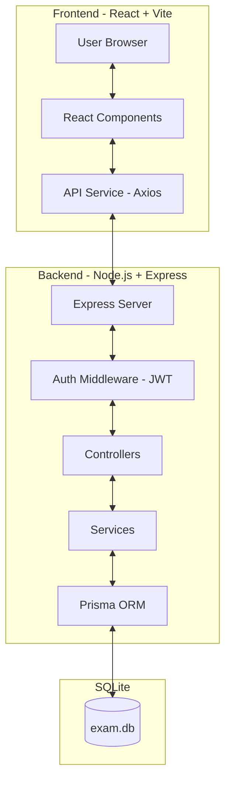

# Architecture Overview - Online Exam Project

## Introduction
This project is a web-based Online Examination System that allows administrators to manage exams and students to take them. The system is designed with a clear separation of concerns between the frontend and backend.

## Architecture Diagram

## Frontend Architecture
- **Framework:** React with TypeScript.
- **Build Tool:** Vite.
- **Styling:** Vanilla CSS for maximum flexibility and custom design.
- **State Management:** React Hooks (useState, useEffect) and Context API if needed.
- **API Integration:** Axios is used to communicate with the backend.
- **Routing:** React Router for client-side navigation.
- **Folder Structure:**
    - `src/components`: Reusable UI components.
    - `src/pages`: Page-level components (Login, Dashboard, Exam, Result).
    - `src/services`: API communication logic.
    - `src/utils`: Helper functions.

## Backend Architecture
- **Platform:** Node.js.
- **Framework:** Express.
- **Authentication:** JSON Web Tokens (JWT) for stateless session management.
- **ORM:** Prisma for interacting with the SQLite database.
- **Architectural Pattern:** MVC-like structure.
    - **Routes:** Define API endpoints and apply middleware.
    - **Controllers:** Handle incoming requests, validate input, and call services.
    - **Middleware:** Auth (JWT verification), Validation, and Multer for file uploads.
- **Database:** SQLite for local development and simplicity.

## Database Schema
The system uses the following core models (managed by Prisma):
- **User:** Stores user credentials (username, password, email), roles (Admin/Student), and full name.
- **Exam:** Stores exam metadata (title, start/end time, duration, max attempts).
- **Question:** Multiple-choice questions linked to an exam.
- **ExamAttempt:** Records a student's attempt at an exam, including score and timing.
- **AttemptDetail:** Detailed record of answers provided for each question in an attempt.

## Security
- **Passwords:** Hashed using `bcrypt` before storage.
- **API Security:** Protected by JWT middleware to ensure only authorized users access certain endpoints.
- **Role-Based Access Control (RBAC):** Admin endpoints are protected by `isAdmin` middleware.
