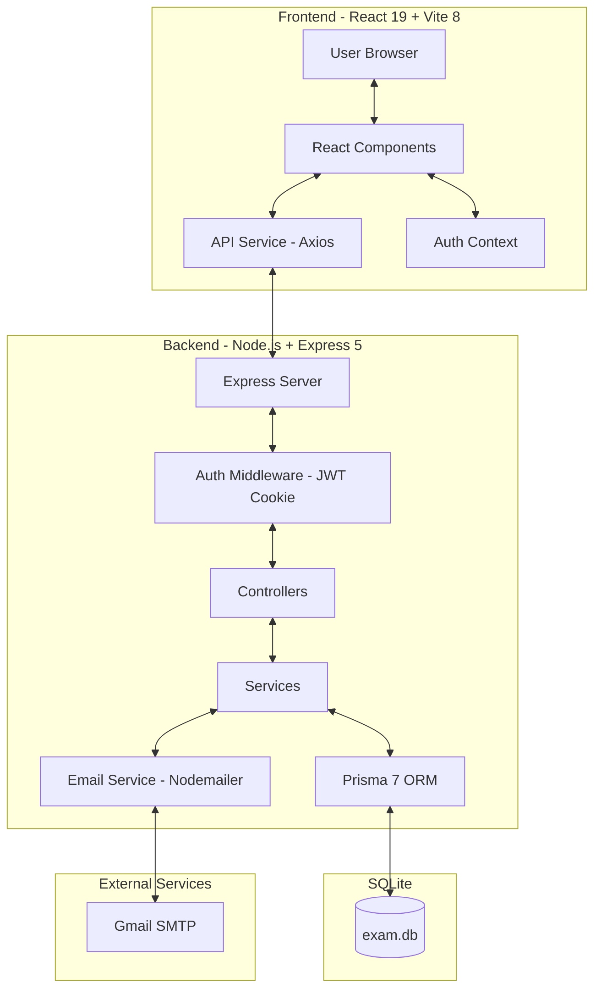

# Architecture Overview - Online Exam Project

## Introduction
This project is a web-based Online Examination System that allows administrators (teachers) to manage exams, question banks, and students, while students can take exams, view results, and manage their profiles. The system includes automated email notifications for student account creation.

## Architecture Diagram


## Project Folder Structure
```text
ONLINE_EXAM_PROJECT/
├── backend/                # Server-side source code (Node.js, Express 5)
│   ├── prisma/             # Database configuration (Prisma 7 ORM)
│   │   ├── schema.prisma   # Database schema definition
│   │   └── migrations/     # Migration history
│   ├── public/             # Static files served by Express
│   │   └── uploads/        # User-uploaded files (profile images)
│   └── src/                # Backend core logic
│       ├── config/         # System configurations (DB connection, Seed)
│       ├── controllers/    # Request handling
│       │   ├── admin/      # Admin controllers (exam, user, import, question, report)
│       │   └── client/     # Student controllers (exam, profile)
│       ├── middleware/     # Intermediate processing layers (Auth, Multer)
│       ├── routes/         # API route definitions (web.ts)
│       ├── services/       # Business logic
│       │   ├── admin/      # Admin services
│       │   ├── client/     # Student services
│       │   ├── auth.service.ts
│       │   └── email.service.ts  # Gmail SMTP email notifications
│       └── types/          # TypeScript type definitions
├── frontend/               # Client-side source code (React 19, Vite 8)
│   ├── public/             # Static assets and templates (CSV, Excel)
│   │   └── templates/      # Import templates for students & questions
│   └── src/                # Frontend core logic
│       ├── components/     # Reusable UI components
│       │   ├── student/    # Student components (StudentSidebar)
│       │   └── teacher/    # Teacher components (Sidebar, Modals, etc.)
│       ├── context/        # App state management (AuthContext)
│       ├── layouts/        # Page layout structures
│       ├── pages/          # Main application pages
│       │   ├── login/
│       │   ├── student-dashboard/
│       │   ├── student-exam/
│       │   ├── student-exams/
│       │   ├── student-profile/
│       │   ├── student-result/
│       │   ├── student-results/
│       │   ├── teacher-dashboard/
│       │   ├── teacher-exam/
│       │   ├── teacher-profile/
│       │   ├── teacher-question/
│       │   ├── teacher-reports/
│       │   └── teacher-student/
│       └── services/       # API communication config (Axios)
└── docs/                   # Documentation and system specifications
```

### Detailed Folder Descriptions

#### **1. Backend (Server-side)**
*   **`prisma/`**: Contains `schema.prisma` for SQLite table definitions and `migrations/` for database history.
*   **`src/config/`**: Database connection setup (`db.ts`) and `seed.ts` for initial system data (default admin account).
*   **`src/controllers/`**: Handles API requests, extracts data, and calls corresponding services.
    *   `admin/exam.controller.ts`: CRUD operations for exams.
    *   `admin/user.controller.ts`: CRUD operations for students.
    *   `admin/import.controller.ts`: Bulk import of students and question banks from Excel/CSV files.
    *   `admin/question.controller.ts`: CRUD operations for question bank.
    *   `admin/report.controller.ts`: Exam statistics and student ranking.
    *   `client/exam.controller.ts`: Student exam flow (list, start, take, submit, results).
    *   `client/profile.controller.ts`: Profile image upload and password change.
*   **`src/middleware/`**: Contains intermediate functions for authentication (`auth.ts` - JWT verification via HTTP-Only Cookie) and file uploads (Multer - memory storage for imports, disk storage for profile images).
*   **`src/services/`**: Core business logic.
    *   `email.service.ts`: Sends auto-generated passwords to students via Gmail SMTP using Nodemailer. Runs asynchronously (fire-and-forget) to not block the import response.
    *   `auth.service.ts`: Authentication helpers.
*   **`src/routes/web.ts`**: Single route file defining all API endpoints with middleware chains.

#### **2. Frontend (Client-side)**
*   **`public/templates/`**: Template files (Excel/CSV) for bulk importing students and question banks.
*   **`src/components/`**: Reusable UI components categorized by role.
    *   `teacher/`: TeacherSidebar, ImportModal, RecentExams, QuickActions, StatGrid, CreateExamModal, DashboardHeader.
    *   `student/`: StudentSidebar.
    *   `ProtectedRoute.tsx` / `PublicRoute.tsx`: Route guards for authentication.
*   **`src/context/`**: Global state management via `AuthContext` for handling login/logout and session restoration via `GET /api/me`.
*   **`src/pages/`**: Each application page is contained within its own directory including logic (`.tsx`) and styling (`.css`). Styling uses Vanilla CSS with a premium glassmorphism design system.
*   **`src/services/api.ts`**: Centralized Axios configuration with `withCredentials: true` for automatic cookie handling.

## Frontend Architecture
- **Framework:** React 19 with TypeScript 6.
- **Build Tool:** Vite 8.
- **Styling:** Vanilla CSS with glassmorphism design, custom CSS variables, and micro-animations. Primary font: Outfit (Google Fonts).
- **State Management:** React Hooks (useState, useEffect) and Context API (AuthContext).
- **API Integration:** Axios with `withCredentials: true` for HTTP-Only Cookie auth.
- **Routing:** React Router v7 for client-side navigation.
- **Icons:** Lucide React.

## Backend Architecture
- **Platform:** Node.js.
- **Framework:** Express 5.
- **Authentication:** JSON Web Tokens (JWT) stored in HTTP-Only Session Cookies for security against XSS attacks.
- **ORM:** Prisma 7 with Better-SQLite3 adapter for interacting with the SQLite database.
- **Email:** Nodemailer with Gmail SMTP for automated student password notifications.
- **File Parsing:** `xlsx` library for Excel/CSV parsing during bulk imports.
- **Architectural Pattern:** MVC-like structure.
    - **Routes (`web.ts`):** Single route file defining all API endpoints with middleware chains.
    - **Controllers:** Handle incoming requests, validate input, and delegate to services.
    - **Middleware:** Auth (JWT verification via HTTP-Only Cookie), Multer (memory storage for imports, disk storage for profile images).
    - **Services:** Business logic layer isolating data handling from controllers.
- **Database:** SQLite for local development, accessed via Prisma's Better-SQLite3 adapter.

## Database Schema
The system uses the following core models (managed by Prisma):
- **User:** Stores user credentials (`code`, `email`, `password`), role (`admin`/`student`), `full_name`, and optional `image` (profile picture path).
- **Exam:** Stores exam metadata (`name` (unique), `start_time`, `end_time`, `duration_mins`, `attempts_num`, `questions_num`).
- **Question:** Multiple-choice questions linked to an exam via `exam_id`. Contains `content`, four options (`option_a` through `option_d`), correct `answer`, and optional `explain`.
- **ExamAttempt:** Records a student's attempt at an exam, including `score`, `start_time`, and `end_time`.
- **AttemptDetail:** Detailed record of each answer provided (`user_answer`, `is_correct`) for each question in an attempt.

## Security
- **Passwords:** Hashed using `bcrypt` before storage.
- **API Security:** Protected by JWT stored in HTTP-Only Session Cookies (immune to XSS attacks, auto-cleared when browser closes).
- **Role-Based Access Control (RBAC):** Admin endpoints are protected by `isAdmin` middleware.
- **File Upload Security:** Multer with file size limits (2MB for profile images, 5MB for imports) and file type validation (jpg, png, webp for images).
- **CORS:** Configured to only allow requests from `http://localhost:5173` with credentials.
