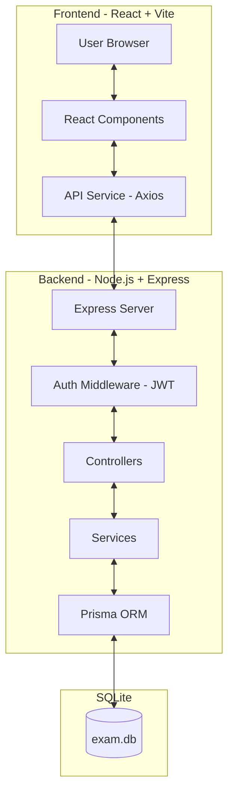

# Architecture Overview - Online Exam Project

## Introduction
This project is a web-based Online Examination System that allows administrators to manage exams and students to take them. The system is designed with a clear separation of concerns between the frontend and backend.

## Architecture Diagram


## Project Folder Structure
```text
ONLINE_EXAM_PROJECT/
├── backend/                # Server-side source code (Node.js, Express)
│   ├── prisma/             # Database configuration (Prisma ORM)
│   └── src/                # Backend core logic
│       ├── config/         # System configurations (DB, Seed)
│       ├── controllers/    # Request handling (Admin & Client)
│       ├── middleware/     # Intermediate processing layers (Auth, Validation)
│       ├── routes/         # API route definitions
│       ├── services/       # Business logic and DB interactions
│       └── types/          # TypeScript type definitions
├── frontend/               # Client-side source code (React, Vite)
│   ├── public/             # Static assets and templates (CSV, Excel)
│   └── src/                # Frontend core logic
│       ├── components/     # Reusable UI components
│       ├── context/        # App state management (AuthContext)
│       ├── layouts/        # Page layout structures
│       ├── pages/          # Main application pages
│       └── services/       # API communication config (Axios)
└── docs/                   # Documentation and system specifications
```

### Detailed Folder Descriptions

#### **1. Backend (Server-side)**
*   **`prisma/`**: Contains `schema.prisma` for SQLite table definitions and `migrations/` for database history.
*   **`src/config/`**: Database connection setup and `seed.ts` for initial system data.
*   **`src/controllers/`**: Handles API requests, extracts data, and calls corresponding services.
    *   `admin/`: Manages exams, users, and data importing.
    *   `client/`: Handles student-side exam processes.
*   **`src/middleware/`**: Contains intermediate functions for authentication (`auth.ts`), file uploads (`multer.ts`), and data validation (`validation.ts`).
*   **`src/services/`**: Core business logic (e.g., scoring, exam processing), isolating data handling from controllers.

#### **2. Frontend (Client-side)**
*   **`public/templates/`**: Template files (Excel/CSV) for bulk importing students and question banks.
*   **`src/components/`**: Reusable UI components categorized by role (Student/Teacher).
*   **`src/context/`**: Global state management, notably `AuthContext` for handling login/logout and session status.
*   **`src/pages/`**: Each application page (Login, Dashboard, Exam) is contained within its own directory including logic (`.tsx`) and styling (`.css`).
*   **`src/services/api.ts`**: Centralized Axios configuration for communicating with the Backend API.

## Frontend Architecture
- **Framework:** React with TypeScript.
- **Build Tool:** Vite.
- **Styling:** Vanilla CSS for maximum flexibility and custom design.
- **State Management:** React Hooks (useState, useEffect) and Context API if needed.
- **API Integration:** Axios is used to communicate with the backend.
- **Routing:** React Router for client-side navigation.
- **Folder Structure:**
    - `src/components`: Reusable UI components.
    - `src/pages`: Page-level components (Login, Dashboard, Exam, Result).
    - `src/services`: API communication logic.
    - `src/utils`: Helper functions.

## Backend Architecture
- **Platform:** Node.js.
- **Framework:** Express.
- **Authentication:** JSON Web Tokens (JWT) for stateless session management.
- **ORM:** Prisma for interacting with the SQLite database.
- **Architectural Pattern:** MVC-like structure.
    - **Routes:** Define API endpoints and apply middleware.
    - **Controllers:** Handle incoming requests, validate input, and call services.
    - **Middleware:** Auth (JWT verification), Cookie Parser (for HTTP-Only sessions), Validation, and Multer for file uploads.
- **Database:** SQLite for local development and simplicity.

## Database Schema
The system uses the following core models (managed by Prisma):
- **User:** Stores user credentials (email, code, password), roles (Admin/Student), and full name.
- **Exam:** Stores exam metadata (title, start/end time, duration, max attempts).
- **Question:** Multiple-choice questions linked to an exam.
- **ExamAttempt:** Records a student's attempt at an exam, including score and timing.
- **AttemptDetail:** Detailed record of answers provided for each question in an attempt.

## Security
- **Passwords:** Hashed using `bcrypt` before storage.
- **API Security:** Protected by JWT middleware to ensure only authorized users access certain endpoints.
- **Role-Based Access Control (RBAC):** Admin endpoints are protected by `isAdmin` middleware.
