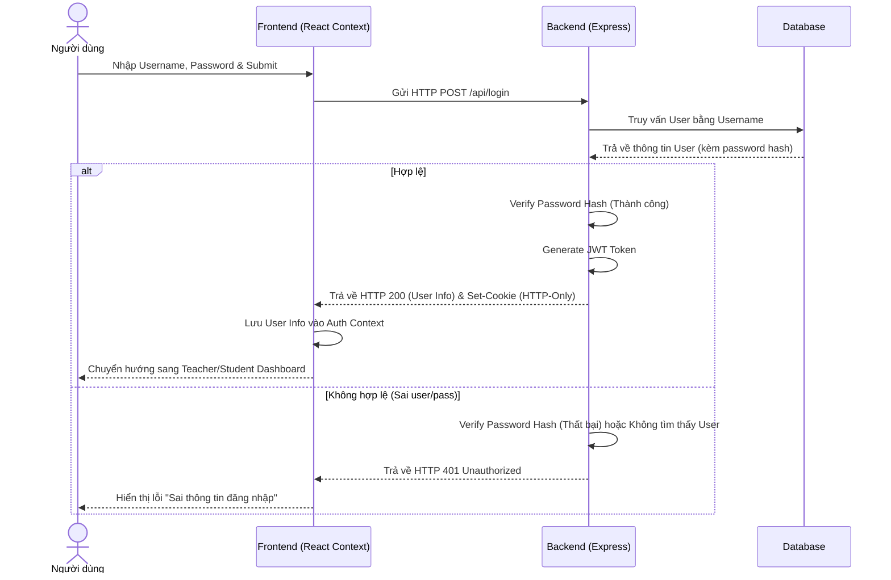
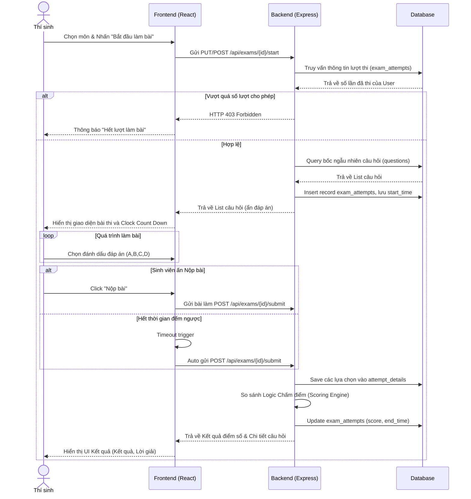
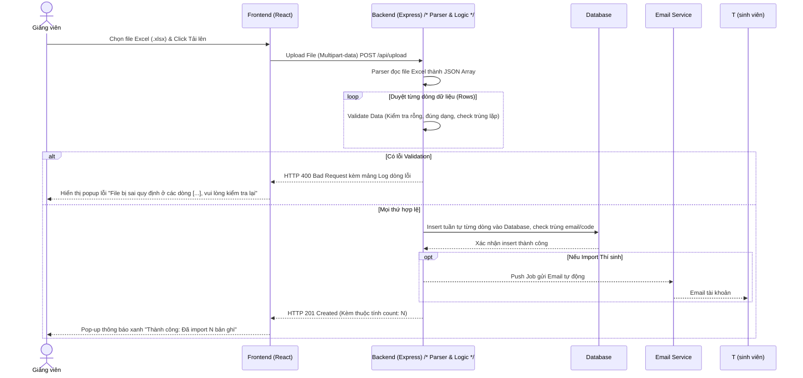

# Tài liệu Đặc tả Use Case (Use Case Specification)

Tài liệu này mô tả đặc tả chi tiết cho các ca sử dụng (Use Cases) quan trọng nhất của hệ thống Online Exam Project, bao gồm luồng làm việc cho Thí sinh và Giảng viên.

---

## 1. UC01: Đăng nhập (Login)

*   **Tên (name) của ca sử dụng:** Đăng nhập hệ thống thi trực tuyến
*   **Mô tả mục đích sử dụng (description):** Cho phép người dùng (Thí sinh hoặc Giảng viên) xác thực danh tính để truy cập vào các vùng tính năng tương ứng với quyền hạn của họ trên hệ thống.
*   **Tác nhân (actors) chính, phụ:**
    *   Chính: Thí sinh, Giảng viên.
    *   Phụ: Hệ thống.
*   **Sự kiện kích hoạt (trigger):** Người dùng truy cập vào trang ứng dụng và nhấn vào nút "Đăng nhập".
*   **Điều kiện tiên quyết (Pre-conditions):** Người dùng đã có tài khoản (Username/Email và Password) được cấp hợp lệ trên hệ thống.
*   **Kịch bản chính (Normal flow):**
    1. Người dùng nhập Username (mã sinh viên hoặc email) và Password vào form.
    2. Người dùng nhấn chọn nút "Đăng nhập".
    3. Hệ thống kiểm tra thông tin đăng nhập so với cơ sở dữ liệu.
    4. Hệ thống xác nhận thông tin đăng nhập hợp lệ.
    5. Hệ thống tạo phiên làm việc bằng cách thiết lập một JWT Token vào HTTP-Only Cookie và phân giải vai trò (Role: Student hoặc Teacher).
    6. Frontend lấy thông tin người dùng lưu vào React Auth Context.
    7. Hệ thống chuyển hướng người dùng đến trang màn hình chính (Dashboard) tương ứng với vai trò đã phân quyền.
*   **Các kịch bản khác (Alternative flows):**
    *   *Nhập sai thông tin (A1):* Ở bước 3, nếu hệ thống phát hiện Username hoặc Password không chính xác, hệ thống sẽ trả về lỗi. Chuyển sang bước 4(alt): Hệ thống hiển thị thông báo "Tài khoản hoặc mật khẩu không chính xác" và yêu cầu người dùng nhập lại (Quay lại bước 1).
    *   *Quên mật khẩu (A2):* Ở bước 1, người dùng có thể chọn chức năng "Quên mật khẩu" nếu không nhớ mật khẩu (Chuyển sang luồng Cấp lại mật khẩu).
    *   *Mở tab mới (A3):* Khi người dùng mở tab mới, Frontend sẽ tự động gọi API `/api/me`. Nhờ HTTP-Only Cookie, hệ thống nhận diện được phiên và Frontend tự động đồng bộ lại Auth Context, cho phép người dùng vào thẳng Dashboard.

**Biểu đồ tuần tự (Sequence Diagram):**

---

## 2. UC02: Bắt đầu và Làm bài thi (Take Exam)

*   **Tên (name) của ca sử dụng:** Bắt đầu và Làm bài thi
*   **Mô tả mục đích sử dụng (description):** Cho phép Thí sinh bắt đầu tham gia một môn thi, nhận đề thi cấu trúc ngẫu nhiên, thao tác chọn đáp án, nộp bài, và xem điểm thi chi tiết ngay lập tức.
*   **Tác nhân (actors) chính, phụ:**
    *   Chính: Thí sinh.
    *   Phụ: Hệ thống.
*   **Sự kiện kích hoạt (trigger):** Thí sinh chọn môn thi từ danh sách hiện có trên Dashboard và nhấn "Bắt đầu làm bài".
*   **Điều kiện tiên quyết (Pre-conditions):** Thí sinh đã đăng nhập. Môn thi đang trong khoảng thời gian có hiệu lực (`start_time` <= thời gian hiện tại <= `end_time`).
*   **Kịch bản chính (Normal flow):**
    1. Thí sinh chọn môn thi và nhấn nút yêu cầu "Bắt đầu làm bài".
    2. Hệ thống kiểm tra số lần dự thi hiện tại của thí sinh cho môn này đối chiếu với quy định tối đa ($k$ lần).
    3. Hệ thống xác nhận số lần thi hợp lệ (chưa vượt quá $k$).
    4. Hệ thống bốc ngẫu nhiên ngân hàng câu hỏi môn đó và tạo ra đề thi riêng biệt.
    5. Hệ thống khởi tạo một bản ghi `exam_attempts` gán cho sinh viên với timestamp hiện tại là `start_time`.
    6. Hệ thống hiển thị giao diện làm bài, mở đếm ngược thời gian và tải danh sách đề thi.
    7. Thí sinh tương tác, thao tác chọn đáp án (tick Radio Button) cho các câu hỏi.
    8. Thí sinh nhấn "Nộp bài" và xác nhận.
    9. Hệ thống lưu lại các câu trả lời (`attempt_details`), chấm điểm so sánh với đáp án đúng, và thiết lập `end_time`.
    10. Hệ thống hiển thị màn hình kết quả ngay lập tức: Điểm số, tổng quan câu đúng/câu sai, và đáp án chuẩn cho các câu sai.
    11. Hệ thống tự động so sánh để nhận kỷ lục điểm cao nhất nếu cần.
*   **Các kịch bản khác (Alternative flows):**
    *   *Quá số lượt thi tối đa (A1):* Ở bước 2, nếu tổng số lượt làm bài của thí sinh đã đạt hoặc vượt ngưỡng $k$, hệ thống từ chối quyền làm bài. Trả ra luồng: Báo lỗi hết lượt thi và đẩy Thí sinh về trang Dashboard.
    *   *Hết thời gian đếm ngược (A2):* Ở bước 7, nếu Clock đếm ngược về 0 mili-giây, hệ thống tự động khóa đề, ngắt kết nối giao diện và tự động gọi chức năng Nộp bài (Chuyển thẳng sang bước 9), bỏ qua bước 8 của thí sinh.

**Biểu đồ tuần tự (Sequence Diagram):**

---

## 3. UC03: Nhập Ngân hàng câu hỏi và Danh sách sinh viên bằng file Excel/CSV

*   **Tên (name) của ca sử dụng:** Nhập Ngân hàng câu hỏi / Danh sách sinh viên bằng file Excel/CSV
*   **Mô tả mục đích sử dụng (description):** Cho phép Giảng viên thêm mới cùng lúc hàng loạt câu hỏi trắc nghiệm hoặc danh sách thông tin tài khoản Thí sinh bằng cách tải lên file Excel (.xlsx) hoặc CSV (.csv) nhằm tiết kiệm thời gian.
*   **Tác nhân (actors) chính, phụ:**
    *   Chính: Giảng viên.
    *   Phụ: Hệ thống.
*   **Sự kiện kích hoạt (trigger):** Giảng viên nhấn nút "Nhập Ngân Hàng Câu Hỏi" hoặc "Nhập Danh Sách Sinh Viên" trong phần Hành động nhanh trên giao diện Dashboard, sau đó tiến hành tải file lên.
*   **Điều kiện tiên quyết (Pre-conditions):** Giảng viên đã đăng nhập và khởi tạo xong phần móng là Môn thi (đã có Exam ID).
*   **Kịch bản chính (Normal flow):**
    1. Giảng viên đính kèm / thả file Excel (.xlsx hoặc .csv) đúng format theo form biểu mẫu mẫu và nhấn Upload.
    2. Frontend gửi file Multipart/form-data đến backend.
    3. Hệ thống Backend tiếp nhận, parse framework đọc dữ liệu tuần tự định dạng bảng (từng dòng/row).
    4. Hệ thống kiểm định Data (Validation): Đối với Question thì cần đủ nội dung, 4 đáp án con, đáp án đúng. Đối với Thí sinh cần đủ full name, email, student id (code).
    5. *(Với Thí sinh có nghiệp vụ phụ):* Hệ thống sinh tự động random password cho từng dòng mới. Lưu vào Database Table `users`. Hệ thống kiểm tra nếu đã tồn tại User có cùng email hoặc code thì bỏ qua bản ghi đó. Sau đó gửi Background Job kích hoạt Email tự động thông báo tài khoản tới email của thí sinh.
    6. Hệ thống thực hiện Insert tuần tự các dòng vào cơ sở dữ liệu (Table `questions` hoặc `users`).
    7. Hệ thống đếm tổng số dòng thành công và thông báo phản hồi lại phía frontend.
    8. Người dùng nhận thông báo "Import thành công {N} bản ghi".
*   **Các kịch bản khác (Alternative flows):**
    *   *Định dạng tệp sai/Không hỗ trợ (A1):* Ở bước 3, file không đọc được nội dung do sai format. Hệ thống trả báo lỗi Invalid File Format.
    *   *Dữ liệu dòng thiếu/Lỗi cấu trúc Excel (A2):* Ở bước 4, có vài dòng trong bảng bị bỏ trống phần bắt buộc. Hệ thống reject hoàn toàn Transaction hoặc chỉ import những dòng đúng kèm log lỗi các dòng sai để người dùng nhận thức và tải lại.

**Biểu đồ tuần tự (Sequence Diagram):**

